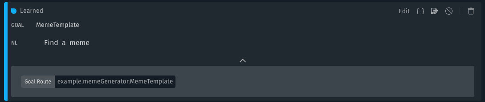
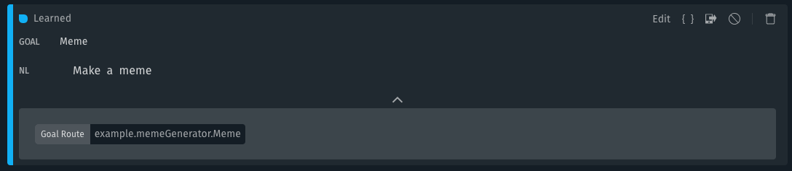
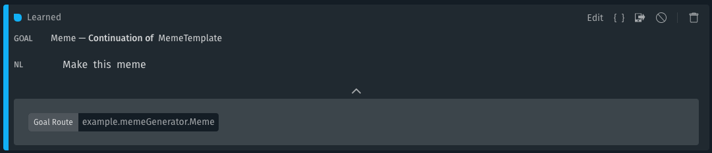
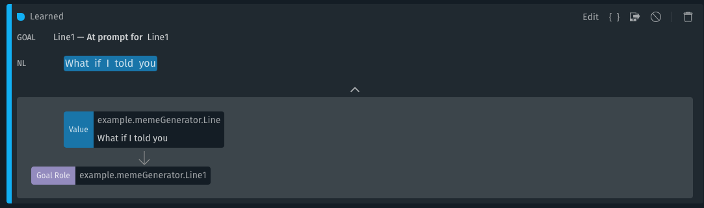

  
   
  <h1 align="Center">Bixby Meme Generator Sample Capsule</h1>

## Overview

Meme Generator is a fun capsule that allows you to make memes! You can find meme templates, generate your own memes, and finally open the meme in your browser for easy sharing. Try meme generator today and make memes like this:

---

## Use cases

### Finding Memes

#### Outer "find" Queries

You can see all trained utterances and plans by entering this query in the
training tab search bar: `goal:MemeTemplate`. Examples:

- Find a meme

- Show me the memes I can make

### Creating Memes

#### Outer "create" Queries

You can see all trained utterances and plans by entering this query in the
training tab search bar: `goal:Meme -has:continue`. For example:

- Make a meme
- Make a raptor meme that says if camera lenses are round on top and why are pictures rectangular on the bottom

We train these to the goal `Meme`, which is the final output that is desired.

#### Inner "create" Queries

You can see all trained utterances and plans by entering this query in the
training tab search bar: `goal:Meme has:continue`. For example:

- Make this meme

### Prompting Flows

#### Line Input Prompt

You can see all trained utterances and plans by entering this query in the
training tab search bar: `prompt:Line1` and `prompt:Line2`. For example:

- What if I told you
- That you don't need many training examples to get NL working

---

## Additional Resources

### Your Source for Everything Bixby
* [Bixby Developer Center](http://bixbydevelopers.com) - Everything you need to get started with Bixby Development!
* [Bixby News, Blogs and Tutorials](https://bixby.developer.samsung.com/) - Bixby News, Tutorials, Blogs and Events

### Guides & Best Practices
* [Quick Start Guide](https://bixbydevelopers.com/dev/docs/get-started/quick-start) - Build your first capsule
* [Design Guides](https://bixbydevelopers.com/dev/docs/dev-guide/design-guides) - Best practices for designing your capsules
* [Developer Guides](https://bixbydevelopers.com/dev/docs/dev-guide/developers) - Guides that take you from design and modeling all the way through deployment of your capsules

### Bixby Videos
* [Bixby Developers YouTube Channel](https://www.youtube.com/c/bixbydevelopers) - Tutorial videos, Presentations, Capsule Demos and more

### Bixby Podcast
* [Bixby Developers Chat](http://bixbydev.buzzsprout.com/) - Voice, Conversational AI and Bixby discussions 

### Bixby on Social Media
* [@BixbyDevelopers](https://twitter.com/bixbydevelopers) - Twitter
* [Facebook](https://facebook.com/BixbyDevelopers)
* [Instagram](https://www.instagram.com/bixbydevelopers/)

### Need Support?
* Have a feature request? Please suggest it in our [Support Community](https://support.bixbydevelopers.com/hc/en-us/community/topics/360000183273-Feature-Requests) to help us prioritize.
* Have a technical question? Ask on [Stack Overflow](https://stackoverflow.com/questions/tagged/bixby) with tag “bixby”
